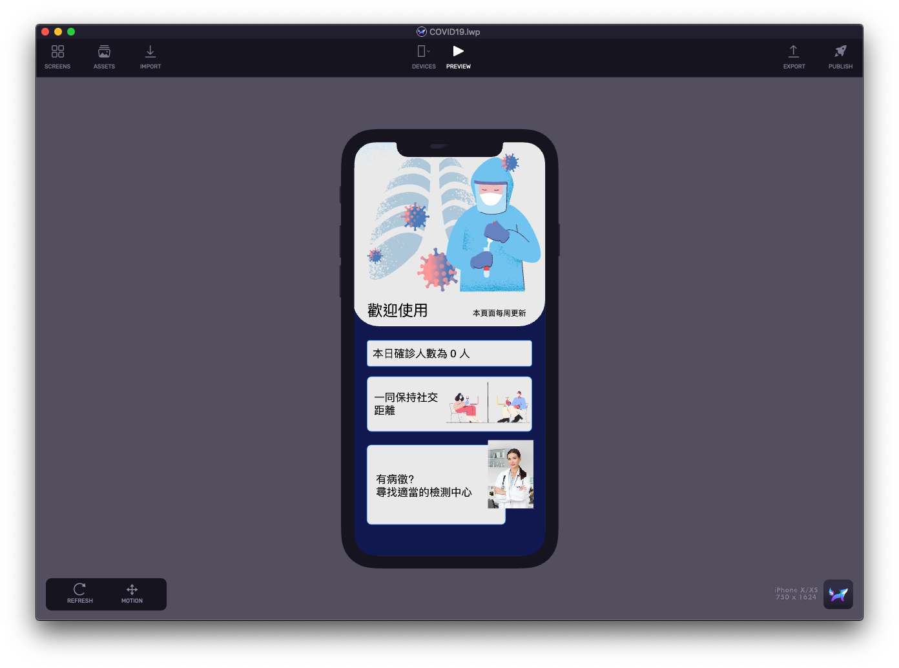

# covid19-Lightwell

## Step1. Download Lightwell App

```
https://lightwell.pro/
```


This app used to create rich animations and interfaces as iOS elements.


## Step2. Download latest file

Lightwell: [https://github.com/1998code/covid19-Lightwell/releases/download/1.0.0/COVID19.lwp.zip](https://github.com/1998code/covid19-Lightwell/releases/download/1.0.0/COVID19.lwp.zip)

Xcode \(Optional\): [https://github.com/1998code/covid19-Lightwell/releases/download/1.0.0x/covid19.xcode.zip](https://github.com/1998code/covid19-Lightwell/releases/download/1.0.0x/covid19.xcode.zip)

## Step3. Open the lwp file via Lightwell




